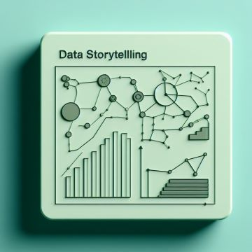

# Portfolio
*"Los datos son el nuevo ADN. Pueden revelar la identidad, la historia y el potencial de cada individuo u organización."*

# Lo que puedo hacer
Como Analista de datos y Analista BI, convierto datos dispersos y sin valor en información estructurada y valiosa aptas para la toma de decisiones basadas en datos. Mi objetivo es mejorar los resultados, tomar las decisiones correctas y ahorrar costes.  

Tengo experiencia en Analisis Descriptivos, Limpieza y Transformación de datos y uso técnicas de Visualización de Datos para la presentación de mis informes. Utilizo principalmente Power BI y Python para mis proyectos de datos.

## Análisis de datos

* Estoy especializado en el análisis de datos. Los resultados, las tendencias y las recomendaciones se presentan claramente en informes o herramientas.

## Visualización de datos
.jpg)

Por medio de visualizaciones o dasboard muestro los datos de manera interactiva. Gracias a esto usted puede explorar y examinar los patrones y tendencias de los datos solo haciendo clics.

## Data Storytelling

* Presento tus datos de una manera inspiradora utilizando una infografía en lugar de un texto. Creo infografías interactivas que pueden ser utilizadas interna o públicamente.

# Sobre Mí
Hola, mi nombre es **Shaquill Márquez** y trabajo en el área de datos como Analista. Tengo un pregrado en ciencias económicas (Economista, Universidad del Atlántico - Col).  
Desde que era un niño siempre me interesó entender como funciona el mundo, unir rompecabezas y resolver acertijos. Fue así como la vida me llevo al mundo de los datos: los datos cuentan una historia que te permite entender situaciones actuales de cualquier índole, resolver incógnitas y llegar conclusiones para tomar las mejores desiciones.
Ver en los datos lo que nadie puede ver es mi reto.

# Mis Proyectos

# [Project 1: Automate Payment Receipts in Excel](https://www.youtube.com/watch?v=qW3ih96Tnpk)

Foto de <a href="https://unsplash.com/es/@pcalescu?utm_content=creditCopyText&utm_medium=referral&utm_source=unsplash">Paul Calescu</a> en <a href="https://unsplash.com/es/fotos/macbook-pro-en-mesa-blanca-KW3m50XRhjk?utm_content=creditCopyText&utm_medium=referral&utm_source=unsplash">Unsplash</a>

  

In this tutorial we automate payment receipts for employees.
* **Tool used:** Excel
* **Input:** Employee Info
* **Output:** Payment receipt in PDF

# [Project 2: How to Create a Profit & Losses Report in Power BI using Zebra BI](https://www.youtube.com/watch?v=SWTHN9d6g2A)

Photo by <a href="https://unsplash.com/@kmuza?utm_source=unsplash&utm_medium=referral&utm_content=creditCopyText">Carlos Muza</a> on <a href="https://unsplash.com/s/photos/income-statement?utm_source=unsplash&utm_medium=referral&utm_content=creditCopyText">Unsplash</a>
  

In this tutorial you will learn how to create an Income Statement in Power BI 
* **Tool used:** Power BI, Zebra BI
* **Input:** Database in Excel
* **Output:** A complete Income Statement created in Zebra BI visual

# [Project 3: How to create a Sales Web App using Python and Streamlit](https://www.youtube.com/watch?v=KU7-V4OC3Jg)

Photo by <a href="https://unsplash.com/@lukechesser?utm_source=unsplash&utm_medium=referral&utm_content=creditCopyText">Luke Chesser</a> on <a href="https://unsplash.com/s/photos/sales-report?utm_source=unsplash&utm_medium=referral&utm_content=creditCopyText">Unsplash</a>  
  

In this tutorial you will learn how to create an automated Sales Web App  
* **Tool used:** Excel, Python, Jupyter Notebook, Streamlit
* **Input:** Database in Excel
* **Output:** Automated Sales Web App with Streamlit

## CONTACTO
Email: shaquillmarquez@gmail.com  
LinkedIn:[(www.linkedin.com/in/shaquillmarquezc)]
